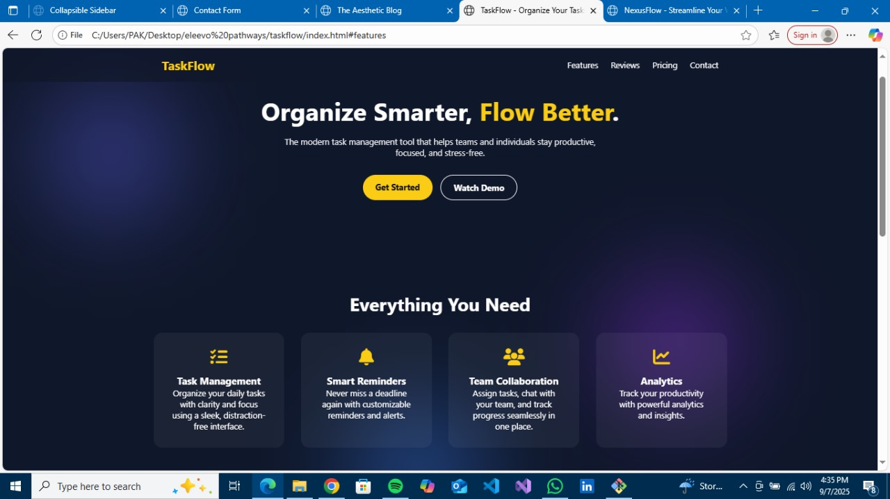
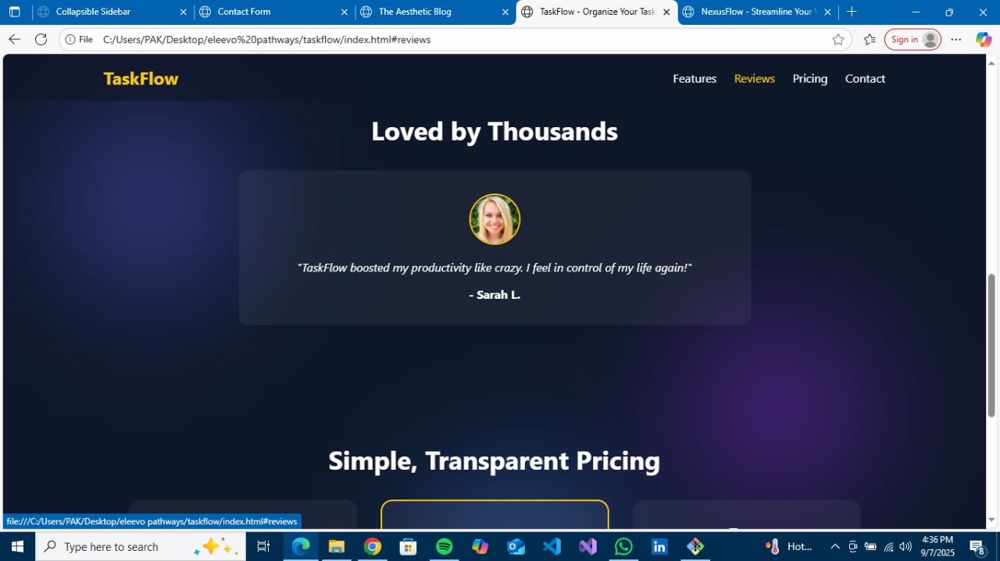
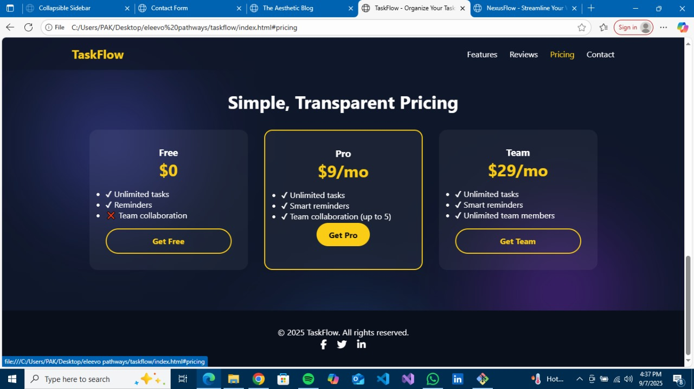

# 🚀 TaskFlow

**TaskFlow** is a modern and responsive **landing page website** designed with **HTML, CSS, and JavaScript**.
It highlights the product’s **features, customer reviews, pricing plans, and contact information**.
This project was built as part of my **Frontend Development Internship Task at @Elevvo Pathways** 💻✨.

---

## ⭐ Features Section

* Showcases **key highlights** of the product/service
* Clean and **icon-based design** for better readability
* Fully **responsive layout** 📱💻

---

## 💬 Reviews Section

* Displays **customer testimonials** with names and roles
* Eye-catching **card-style design** ✨
* Adds **trust and credibility** to the product

---

## 💲 Pricing Section

* Simple and transparent **pricing plans**
* Highlighted **best-value plan** 🏆
* Responsive grid layout for all devices

---

## 📩 Contact Section

* **Contact form** with Name, Email, and Message fields
* Form validation for **better user experience**
* Easy to integrate with backend or API services

---

## 🛠️ Tech Stack

* 🏗️ **HTML5** – Page structure
* 🎨 **CSS3** – Styling and responsive design
* ⚡ **JavaScript** – Interactivity and form validation

---

## 📂 Project Structure

```bash
📦 taskflow
 ┣ 📜 index.html       # Landing page structure
 ┣ 📜 style.css        # Styling and layout
 ┣ 📜 script.js        # Interactivity & validation
 ┗ 📜 README.md        # Documentation
```

---

## 📸 Screenshots

### 🖥️ Features Section



### 📱 Testimonial Section



### Pricing Section



---

## 🔧 Installation & Usage

1. Clone this repository ⬇️

   ```bash
   git clone https://github.com/your-username/taskflow.git
   ```
2. Move into the project folder 📂

   ```bash
   cd taskflow
   ```
3. Open **index.html** in your browser 🌐

---

## 🚧 Future Improvements

✨ Add **animations** for section transitions
✨ Improve **form backend integration**
✨ Add **dark/light mode** toggle

---

## 👨‍💻 Author

Developed by **Hina Hanif** as part of my **Frontend Development Internship** 💼

---

Do you want me to also make this README **section-by-section aligned** (like with emojis as headings: ⭐ Features, 💬 Reviews, 💲 Pricing, 📩 Contact) to match the exact structure of your site?
